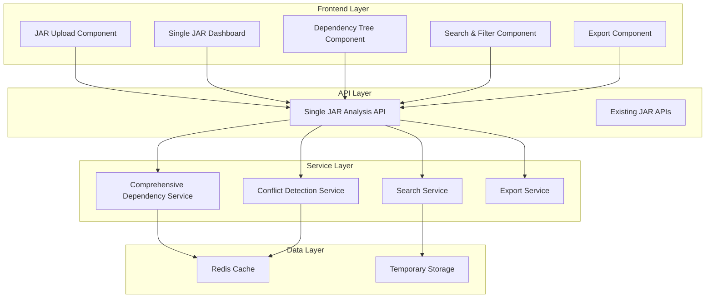

# Design Document - Single JAR Dependency Analysis

## Overview

This design addresses the Phase 8 implementation issues with single JAR dependency analysis by creating a comprehensive, single-page dependency view. The solution leverages the existing comprehensive dependency analysis service and conflict detection capabilities while introducing a new unified dashboard specifically for single JAR analysis.

The design focuses on consolidating all dependency information into one cohesive interface that provides complete visibility into direct dependencies, transitive dependencies, version conflicts, and export capabilities without requiring navigation between multiple views.

## Architecture

### High-Level Architecture



### Component Integration Strategy

The design reuses existing Phase 8 services while adding a new orchestration layer specifically for single JAR analysis. This approach ensures consistency with the current system while addressing the specific requirements for comprehensive single-page dependency analysis.

## Components and Interfaces

### 1. Single JAR Analysis API

**New API Endpoint**: `/api/v1/jars/{jar_id}/analysis/comprehensive`

```python
class SingleJarAnalysisAPI:
    """Comprehensive single JAR analysis orchestration"""
    
    async def get_comprehensive_analysis(self, jar_id: str) -> ComprehensiveAnalysisResponse:
        """
        Orchestrates all dependency analysis services to provide:
        - Complete dependency tree (direct + transitive)
        - Version information and sources
        - Conflict detection and severity classification
        - Framework detection results
        - Search index preparation
        """
    
    async def get_dependency_tree(self, jar_id: str, expand_level: int = 2) -> DependencyTree:
        """
        Returns hierarchical dependency tree with configurable expansion:
        - Root level: Direct dependencies
        - Level 1+: Transitive dependencies
        - Conflict indicators at each level
        - Version resolution information
        """
    
    async def search_dependencies(self, jar_id: str, query: str, filters: SearchFilters) -> SearchResults:
        """
        Dependency-specific search functionality:
        - Name-based filtering
        - Version-based filtering
        - Scope-based filtering
        - Conflict status filtering
        """
```

### 2. Single JAR Dashboard Component

**New React Component**: `SingleJarDashboard.tsx`

```typescript
interface SingleJarDashboardProps {
  jarId: string;
}

interface DashboardState {
  analysisData: ComprehensiveAnalysisData;
  expandedNodes: Set<string>;
  searchQuery: string;
  activeFilters: FilterState;
  selectedDependency: Dependency | null;
  loading: boolean;
  error: string | null;
}

export const SingleJarDashboard: React.FC<SingleJarDashboardProps> = ({ jarId }) => {
  // State management for comprehensive analysis view
  // Integration with existing JAR viewer store
  // Real-time search and filtering
  // Export functionality integration
};
```

### 3. Enhanced Dependency Tree Component

**Enhanced Component**: `DependencyTreeView.tsx`

```typescript
interface DependencyTreeNode {
  id: string;
  name: string;
  version: string;
  source: string;
  scope?: string;
  conflicts: Conflict[];
  children: DependencyTreeNode[];
  isExpanded: boolean;
  level: number;
}

interface DependencyTreeProps {
  dependencies: DependencyTreeNode[];
  onNodeSelect: (node: DependencyTreeNode) => void;
  onNodeExpand: (nodeId: string) => void;
  searchQuery: string;
  activeFilters: FilterState;
}
```

### 4. Conflict Visualization Component

**New Component**: `ConflictVisualization.tsx`

```typescript
interface ConflictVisualizationProps {
  conflicts: Conflict[];
  dependencies: Dependency[];
  onConflictSelect: (conflict: Conflict) => void;
}

// Visual indicators for conflict severity:
// - Critical: Red background, warning icon
// - High: Orange background, alert icon
// - Medium: Yellow background, caution icon
// - Low: Blue background, info icon
```

### 5. Search and Filter Component

**Enhanced Component**: `DependencySearchFilter.tsx`

```typescript
interface SearchFilters {
  namePattern: string;
  versionPattern: string;
  scopes: string[];
  conflictStatus: ConflictSeverity[];
  sources: string[];
}

interface DependencySearchProps {
  onSearch: (query: string, filters: SearchFilters) => void;
  totalDependencies: number;
  filteredCount: number;
  availableScopes: string[];
  availableSources: string[];
}
```

## Data Models

### 1. Comprehensive Analysis Response

```typescript
interface ComprehensiveAnalysisData {
  jarMetadata: JarMetadata;
  dependencyTree: DependencyTreeNode[];
  conflicts: Conflict[];
  summary: AnalysisSummary;
  frameworks: DetectedFramework[];
  searchIndex: SearchIndex;
}

interface AnalysisSummary {
  totalDependencies: number;
  directDependencies: number;
  transitiveDependencies: number;
  conflictCounts: {
    critical: number;
    high: number;
    medium: number;
    low: number;
  };
  uniqueVersions: number;
  duplicateArtifacts: number;
}
```

### 2. Enhanced Dependency Model

```typescript
interface EnhancedDependency extends Dependency {
  // Existing fields from current Dependency model
  // Plus additional fields for single JAR analysis:
  
  dependencyPath: string[];        // Path from root to this dependency
  isDirectDependency: boolean;     // Whether directly declared
  conflictStatus: ConflictSeverity | null;
  resolutionStrategy: string;      // How version conflicts are resolved
  usageContext: string[];          // Where this dependency is used
  licenseCompatibility: string;    // License compatibility status
}
```

### 3. Dependency Tree Structure

```typescript
interface DependencyTreeNode {
  dependency: EnhancedDependency;
  children: DependencyTreeNode[];
  parent: DependencyTreeNode | null;
  level: number;
  isExpanded: boolean;
  hasConflicts: boolean;
  conflictSeverity: ConflictSeverity | null;
}
```

## Error Handling

### 1. Analysis Failure Scenarios

```typescript
enum AnalysisErrorType {
  JAR_NOT_FOUND = 'jar_not_found',
  ANALYSIS_IN_PROGRESS = 'analysis_in_progress',
  DEPENDENCY_EXTRACTION_FAILED = 'dependency_extraction_failed',
  CONFLICT_DETECTION_FAILED = 'conflict_detection_failed',
  SEARCH_INDEX_FAILED = 'search_index_failed'
}

interface AnalysisError {
  type: AnalysisErrorType;
  message: string;
  details?: any;
  retryable: boolean;
  suggestedAction: string;
}
```

### 2. Graceful Degradation Strategy

- **Partial Analysis**: Display available data even if some analysis components fail
- **Retry Mechanisms**: Automatic retry for transient failures
- **Fallback UI**: Simplified view when full analysis is unavailable
- **Error Boundaries**: React error boundaries to prevent complete UI failure

### 3. User Feedback

```typescript
interface LoadingState {
  isLoading: boolean;
  stage: 'uploading' | 'extracting' | 'analyzing' | 'indexing' | 'complete';
  progress: number;
  message: string;
}
```

## Testing Strategy

### 1. Component Testing

```typescript
// Unit tests for new components
describe('SingleJarDashboard', () => {
  test('renders comprehensive analysis data correctly');
  test('handles search and filtering');
  test('manages tree expansion state');
  test('displays conflict information');
  test('handles export functionality');
});

describe('DependencyTreeView', () => {
  test('renders hierarchical dependency structure');
  test('handles node expansion/collapse');
  test('applies search filters correctly');
  test('highlights conflicts appropriately');
});
```

### 2. Integration Testing

```python
class TestSingleJarAnalysisIntegration:
    """Integration tests for comprehensive analysis"""
    
    async def test_comprehensive_analysis_workflow(self):
        """Test complete analysis from JAR upload to dashboard display"""
        
    async def test_conflict_detection_integration(self):
        """Test conflict detection with dependency tree building"""
        
    async def test_search_functionality_integration(self):
        """Test search across dependency tree with filtering"""
        
    async def test_export_functionality_integration(self):
        """Test export of comprehensive analysis data"""
```

### 3. Performance Testing

```python
PERFORMANCE_TARGETS = {
    'comprehensive_analysis': '< 2 seconds for typical JARs',
    'tree_rendering': '< 500ms for 1000+ dependencies',
    'search_response': '< 100ms for dependency filtering',
    'conflict_detection': '< 1 second for complex dependency trees'
}
```

## Implementation Approach

### Phase 1: Backend API Enhancement
1. Create comprehensive analysis orchestration service
2. Enhance existing dependency service for tree structure
3. Add search indexing for dependencies
4. Implement export functionality for comprehensive data

### Phase 2: Frontend Dashboard Development
1. Create SingleJarDashboard component
2. Enhance DependencyTreeView for hierarchical display
3. Implement search and filtering UI
4. Add conflict visualization components

### Phase 3: Integration and Testing
1. Integrate new dashboard with existing JAR viewer
2. Add comprehensive testing suite
3. Performance optimization and caching
4. User acceptance testing and feedback integration

### Phase 4: Deployment and Monitoring
1. Deploy enhanced functionality
2. Monitor performance metrics
3. Gather user feedback
4. Iterative improvements based on usage patterns

## Security Considerations

### 1. Data Access Control
- Ensure dependency analysis respects existing JAR access controls
- Validate all search queries to prevent injection attacks
- Sanitize export data to prevent information leakage

### 2. Resource Management
- Implement caching for expensive dependency analysis operations
- Set reasonable limits on dependency tree depth and breadth
- Monitor memory usage during large JAR analysis

### 3. Input Validation
- Validate all API parameters for comprehensive analysis requests
- Sanitize search queries and filter parameters
- Ensure export format parameters are within allowed values

This design provides a comprehensive solution for single JAR dependency analysis while leveraging existing Phase 8 capabilities and maintaining consistency with the current system architecture.